# BraPolar 👨‍🔬
BraPolar, an m-Health for remote monitoring of patients with Bipolar Affective Disorder, presenting real-time mood and behavior fluctuations in participants through interaction with their mobile devices. 
 
**Specialist user (center) monitoring Mood fluctuations of two patients (left and right)**
<h1 align="center">
  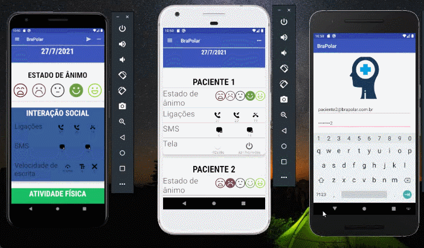
</h1>

---
## 🧾 About
**BraPolar v1.0**, is an Android m-Health for remote monitoring of patients with Bipolar Affective Disorder. The app present in real-time mood and behavior fluctuations to specialists from participants through their interaction with the mobile devices. This project was part of my master degree dissertation in Brazil. In this work, I could execute all software development cycles from scratch, application and documentation. Also, I could practice all research process of scientific research writing and presenting this work in a international conference at Kyoto, Japan.

---
## 📷 Screenshots


**Project scratch**
<h1 align="center">
  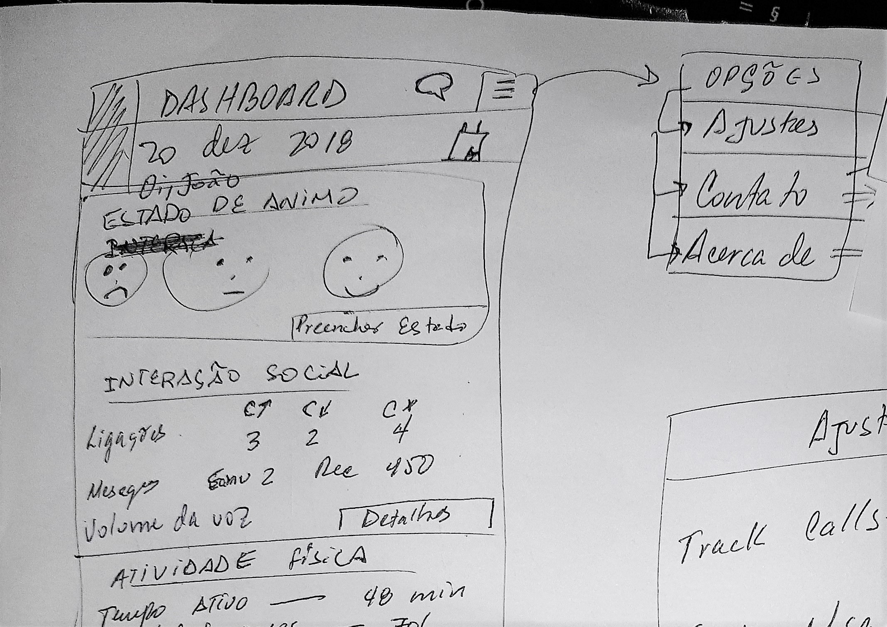
</h1>


**Task planning**
<h1 align="center">
  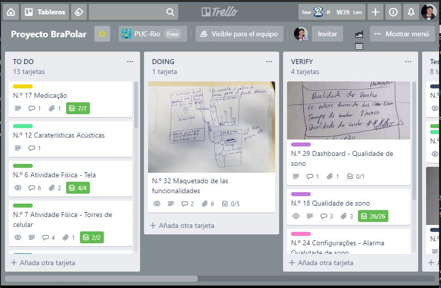
</h1>


**Bipolar sympthons and how follow-up with cellphone sensors**
<h1 align="center">
  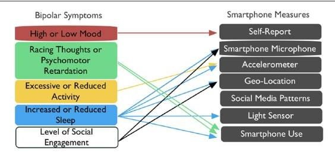
</h1>

**Firebase data stream arquitecture**
<h1 align="center">
  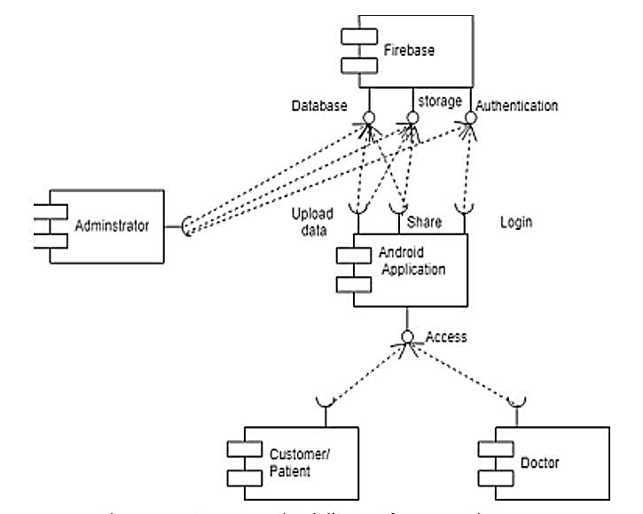
</h1>

**BraPolar login (left), participant home (center), keyboard typing (left)
<h1 align="center">
  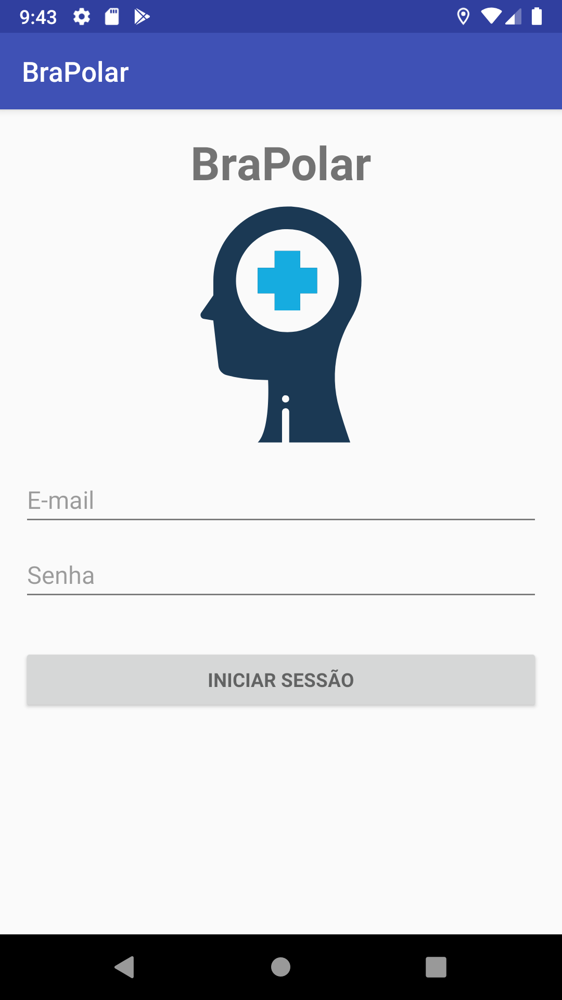 
  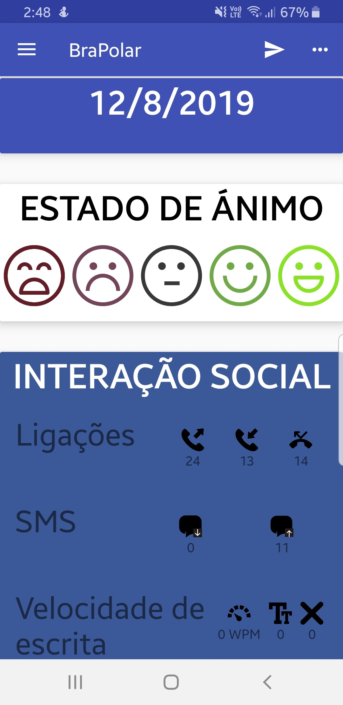  
  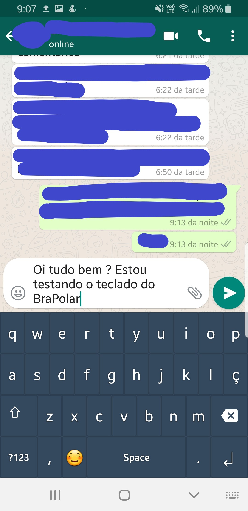
</h1>

**Firebase active users during data capture**
<h1 align="center">
  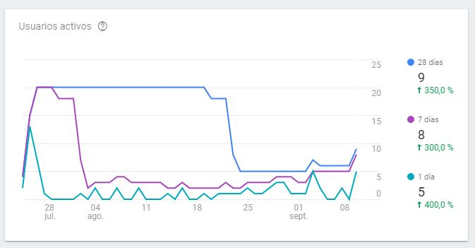
</h1>


**Firebase non-relational database instance**
<h1 align="center">
  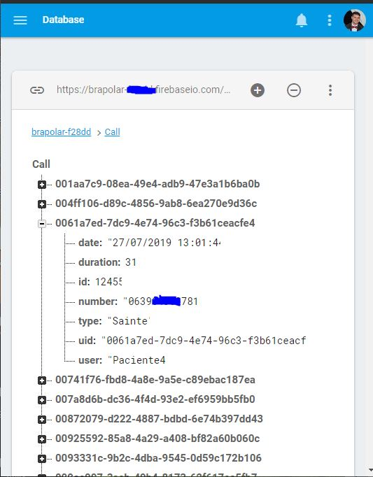
</h1>


**Work presentation in Kyoto, Japan**
<h1 align="center">
  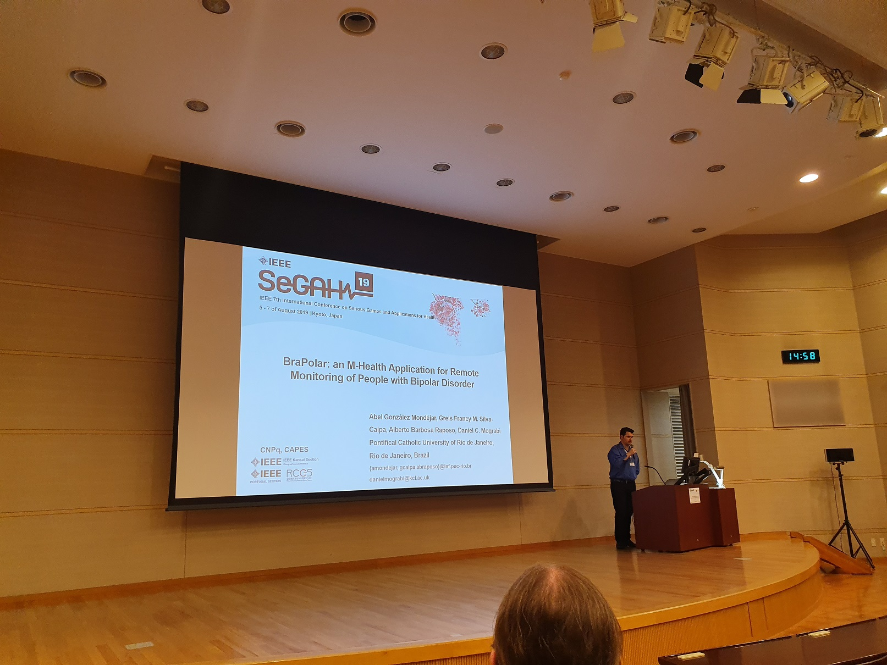
 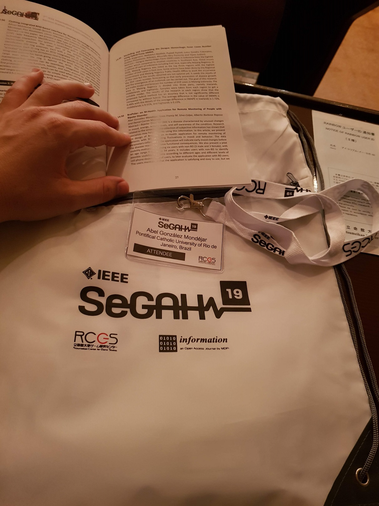
</h1>

---
## 🕖 Versioning
- BraPolar v3.0 (expected in 20/06/2023)
- BraPolar v2.4 (relased in 07/07/2022)
- BraPolar v2.3 (relased in 21/05/2022)
- BraPolar v2.2 (relased in 02/08/2021)
- BraPolar v2.1 (relased in 17/11/2020)
- BraPolar v2.0 (relased in 19/07/2019)
- BraPolar v1.0 (relased in 11/02/2019)
- BraPolar v0.5 (relased in 12/10/2018)

This project was part of my master degree dissertation and my PhD thesis, which is running. From v1.0, to preserve scientific code rights, I will not upload new public versions on Github until concluding my doctoral degree and get the authorization to publish all code.    

---
## ✅ Main tracking features
- [x] Mood
- [x] Medication
- [x] Sleep patterns
- [x] Status Overview
- [x] Physical activity
- [x] Social interaction
- [] Psychomotor activity
- [] Specialized assistance
- [] Acoustic characteristics


---
## 🔧 Technology
- [Android](https://www.android.com/) 💚
- [Java](https://www.java.com/) 
- [Firebase](https://firebase.google.com/) 

---
## 👨‍💻 How to Setup

```bash
  # Clone the project
  $ git clone https://github.com/abelgonzalez/BraPolar.git
```
```bash
  # Enter directory
  $ cd BraPolar
```

Download and install:
 - [Android Studio](https://developer.android.com/android-studio/download)  
 - [JRE](https://www.java.com/en/download/manual.jsp)   
  
     
---
## 😎 How to Run

*Build an BraPolar app:
 - Make sure the database in Firebase was correctly loaded and you have a stable internet connection.  
 - Load root project folder (**BraPolar**) with Android Studio and run it.
 - When apps run, [grant all permissions to android application](https://youtu.be/sE-cXkv3m7o). 

or

*Executes a apk in your Android phone:
 - Enter in (...)\BraPolar\app\build and execute "BraPolarv1.0.apk" with login "login instructions.txt".

---
## 🤓 Scientific contributions
* A. G. Mondéjar, G. F. M. Silva-Calpa, A. B. Raposo and D. C. Mograbi, "BraPolar: an M-Health Application for Remote Monitoring of People with Bipolar Disorder," 2019 IEEE 7th International Conference on Serious Games and Applications for Health (SeGAH), Kyoto, Japan, 2019, pp. 1-8, doi: 10.1109/SeGAH.2019.8882469. 
* A. González Mondéjar, G. F. M. Silva-Calpa, A. Barbosa Raposo and D. C. Mograbi, "An m-Health Application for Remote Monitoring of People with Bipolar Disorder through Digital Phenotyping and Smartphone Dependency," 2020 IEEE 33rd International Symposium on Computer-Based Medical Systems (CBMS), Rochester, MN, USA, 2020, pp. 388-391, doi: 10.1109/CBMS49503.2020.00080.


---
## 👉 Additional information
* App Demo [YouTube](https://youtu.be/8dGao-oN-EE)
* BraPolar patient interaction demo [YouTube](https://youtu.be/cecpac-bmH4)
* BraPolar specialists interaction demo [YouTube](https://youtu.be/7gtjYNlSh6w)
* Master degree dissertation [document](https://bdtd.ibict.br/vufind/Record/PUC_RIO-1_a2695ae927b56d67051524f2afd2ae3c) (in Portuguese).
* In case of sensitive bugs like security vulnerabilities, don't hesitate to contact me at abelgodev@gmail.com instead of using the issue tracker. I value your effort to improve the security and privacy of this project!

---
## 📝 License

This project is under the MIT license. See the file <a href="https://github.com/abelgonzalez/BraPolar/LICENSE">LICENCE</a> for more details.

---
## 🧑‍💻 Author
<p align="center">Done with 💙 by Abel González Mondéjar</p>


[](https://www.linkedin.com/in/abelgonzalezmondejar/)

